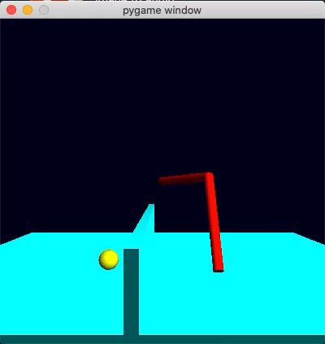

# Motion planning for robotic arm

### Methods implemented :

* RRT 
* Optimisation based motion planning ( similar to CHOMP  )

### Results: 



### Instructions :

```
python reach_target_traj_opt.py
python reach_target_traj_rrt.py
```

